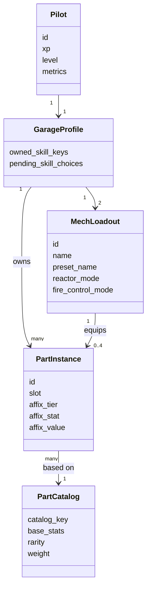
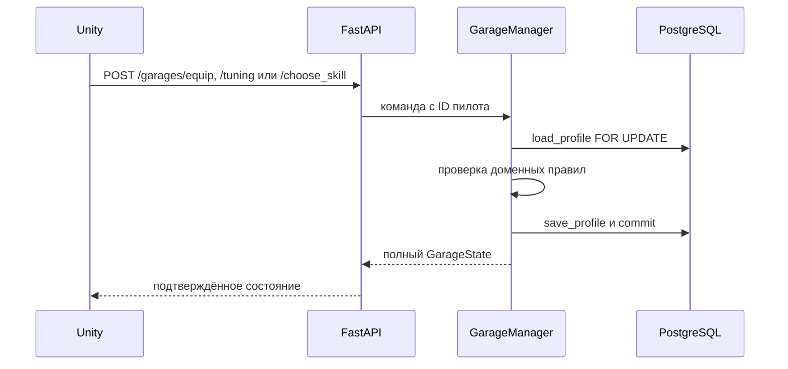

# Гараж

Гараж — постоянное состояние пилота между матчами. Он хранится в PostgreSQL;
Unity-клиент показывает подтверждённое сервером состояние и отправляет только
намерения игрока. Правила сборки, веса, тюнинга и навыков не дублируются в C#.

Связанные документы: [PERSISTENCE.md](PERSISTENCE.md),
[LOOT_DESIGN.md](LOOT_DESIGN.md), [ROADMAP.md](ROADMAP.md).

## Модель

- У пилота ровно две независимые сборки. Оружие каждой сборки пока задаёт
  стартовый пресет и не редактируется в гараже.
- Деталь — физический экземпляр `PartInstance`, поэтому одна деталь не может
  одновременно стоять на двух мехах. Неустановленные экземпляры возвращаются
  в `stored_parts`.
- У рук один слот выбора детали; в бою мех создаёт левую и правую руки с
  раздельной прочностью из одного экземпляра.
- Вес включает детали и оружие. Грузоподъёмность задают ноги. Сервер отвергает
  установку, если новая сборка превышает лимит; состояние в БД не меняется.
- Аффикс хранится на экземпляре (`+1..+3`) и уже включён в отданные
  характеристики детали. Клиент не прибавляет его повторно.
- Навыки принадлежат пилоту, а не сборке, и действуют у обоих мехов. Выборы
  из `pending_skill_choices` обрабатываются последовательно: доступен только
  первый ожидающий уровень.

## Тюнинг и боевой снимок

С 2026-10-07 HP, прочность, урон и сила удара используют масштаб ×10.
Реактор `fortified` даёт +20 HP / −1 AP, `overdrive` — −20 HP / +1 AP.
Управление огнём `precision` даёт +5 точности / −10 урона, `impact` —
−5 точности / +10 урона. Аффиксы HP/силы удара масштабированы вместе
с базовыми статами; уровень аффикса `+1..+3` остался прежним.

- Настройки реактора: `fortified`, `neutral`, `overdrive`.
- Настройки управления огнём: `precision`, `neutral`, `impact`.
- Тюнинг применяется при сборке боевых `Player` перед матчем: он изменяет
  здоровье, AP, точность и урон оружия. Гараж не хранит отдельный второй набор
  боевых статов.
- Перед матчем сервер собирает новых боевых акторов из свежего снимка гаража;
  полученный в бою урон деталей и HP обратно в гараж не записываются.

## Контракт и клиент

| Операция | Контракт | Поведение клиента |
| --- | --- | --- |
| Получить гараж | `GET /garages/{player_id}` | Обновляет полный `GarageState` |
| Установить деталь | `POST /garages/equip` | Отправляет ID пилота, сборки и экземпляра |
| Настроить сборку | `POST /garages/tuning` | Отправляет оба режима активной сборки |
| Выбрать навык | `POST /garages/choose_skill` | Отправляет ID пилота и ключ навыка |

Все изменяющие запросы возвращают полный `GarageState`. Unity принимает этот
ответ целиком и не делает optimistic update. На время команды экран блокирует
параллельные изменения. При отказе показывает `detail` сервера и сохраняет
предыдущее состояние; после неопределённой сетевой ошибки перед следующей
командой перечитывает гараж.

Экран Unity устроен так:

- вкладки `Мех 1` и `Мех 2` показывают итоговые статы и вес выбранной сборки;
- внутри меха — вкладки `Тюнинг`, `Руки`, `Ноги`, `Корпус`, `Голова`;
  тюнинг содержит настройки реактора и наведения, а вкладки слотов —
  установленную деталь и подходящие свободные детали со склада;
  информация об оружии находится во вкладке `Руки`;
- вкладка `Пилот` показывает навыки и доступный выбор;
- отдельного склада и фильтра слота внизу нет; у свободной детали в её вкладке
  доступны «Сравнить» и «Установить» для выбранного меха;
- итоговые статы и дельты после операции берутся только из ответа сервера.

## Границы MVP

В текущем контракте намеренно отсутствуют снятие детали без замены, прямой
перенос между мехами, смена оружия и пресета, продажа, крафт, сброс навыков и
переименование сборки. Их не следует имитировать кнопками до появления
серверных правил и API.
